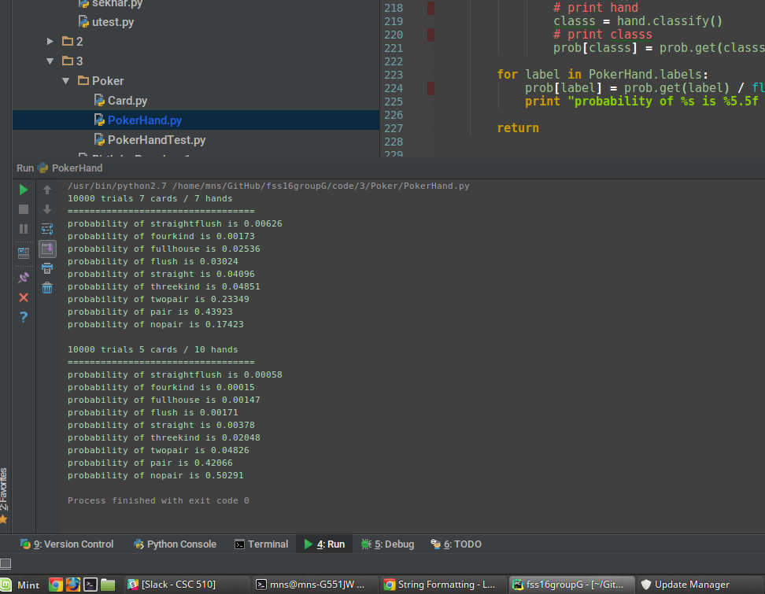

## Poker

#### Functions to check the specified type of hand. Implemented inside `class PokerHand`
```python
   def has_straightflush(self):
   def has_fourkind(self):
   def has_fullhouse(self):
   def has_straight(self):
   def has_threekind(self):
   def has_pair(self):
   def has_twopair(self):
```

#### Utility functions that are used inside the above funtions

```python
   def has_nkind(self, n):
   def rank_card_mapper(self):
   def belong_to_same_suit(self, rank_list, suit):
```

#### Function that classifies the hand
```python
   def classify(self):
```

#### Function that simulates hands and calculates probabilities for various hands
```python
   def classify(self):
```

Output :

