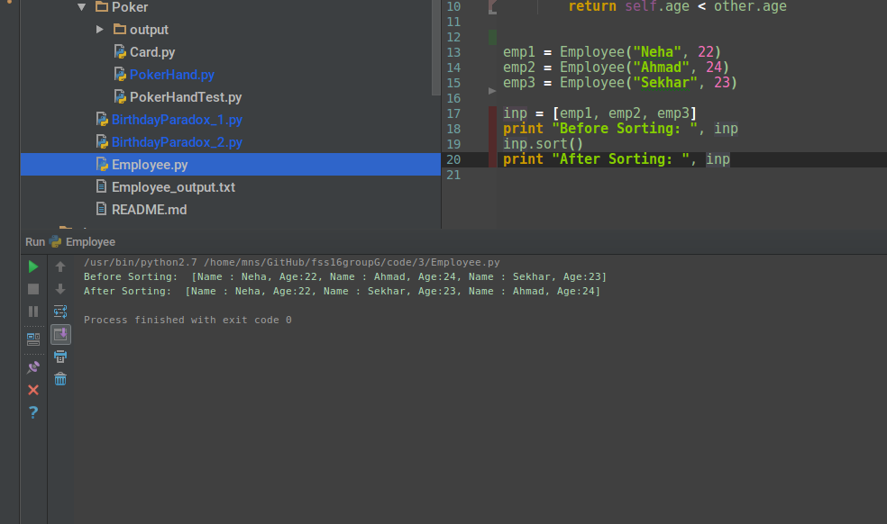
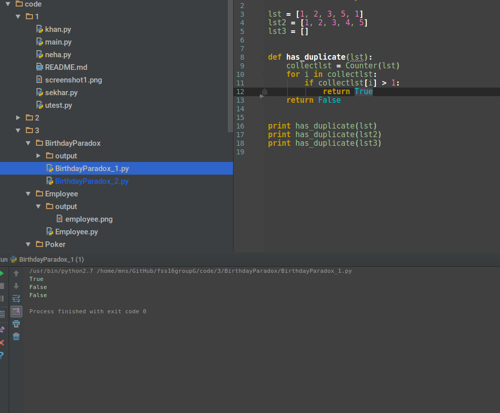
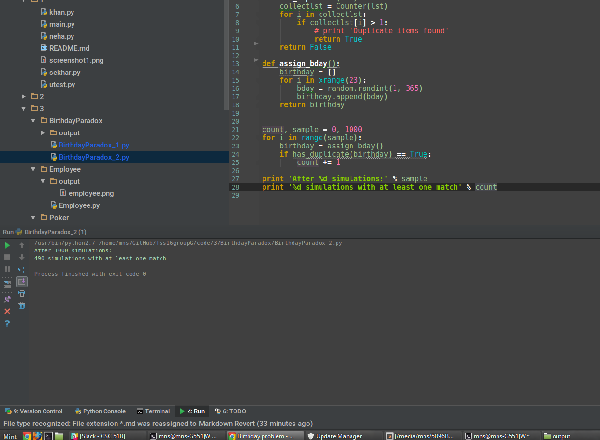

## Employee
```python
class Employee:
    def __init__(self, name, age):
        self.name = name
        self.age = age

    def __repr__(self):
        return 'Name : %s, Age:%s' % (self.name, self.age)

    def __lt__(self, other):
        return self.age < other.age


```
Output:
 

-----------

## Birthday Paradox 
```python
def has_duplicate(lst):
    collectlst = Counter(lst)
    for i in collectlst:
        if collectlst[i] > 1:
            return True
    return False

```

Output
 
 


-----------------

## Poker :spades: :hearts: :clubs: :diamonds:

#### Functions to check the specified type of hand. Implemented inside `class PokerHand`
```python
    def has_straightflush(self):
    def has_fourkind(self):
    def has_fullhouse(self):
    def has_straight(self):
    def has_threekind(self):
    def has_pair(self):
    def has_twopair(self):
```
 
#### Utility functions that are used inside the above funtions
 
```python
    def has_nkind(self, n):
    def rank_card_mapper(self):
    def belong_to_same_suit(self, rank_list, suit):
```
 
#### Function that classifies the hand
```python
    def classify(self):
```
 
#### Function that simulates hands and calculates probabilities for various hands
 ```python
    @staticmethod
    def simulate(trials, hands):
```
Output :
 
