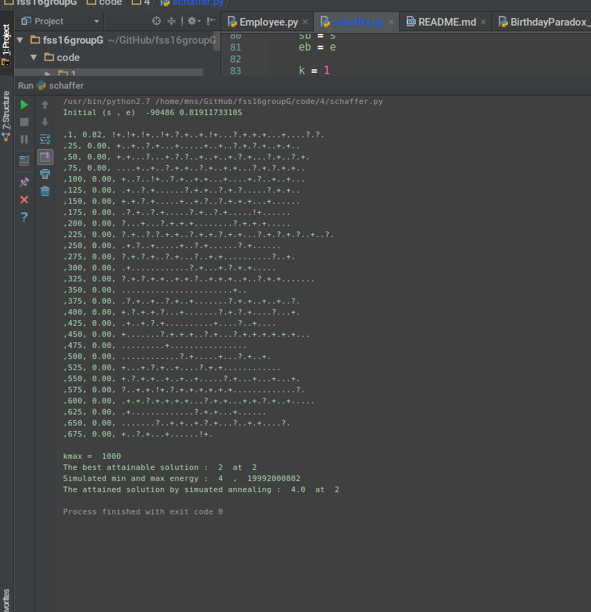
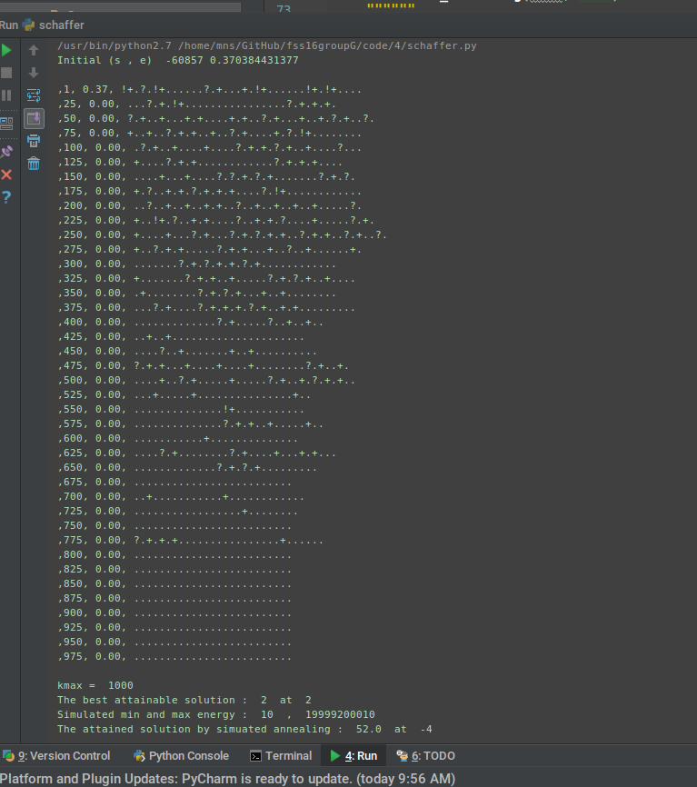

###  Simulated annealer for the Schaffer model.

### Acceptance function
`exp( (solutionEnergy - neighbourEnergy) / temperature )`

### Interesting reads:
1. http://www.theprojectspot.com/tutorial-post/simulated-annealing-algorithm-for-beginners/6
2. 


### Output





### Code

```python
def simulated_annealing(kmax, emin):
    min_ener, max_ener = get_random_min_max(100000)
    s = random.randint(SCHAFFER_X_MIN, SCHAFFER_X_MAX)
    e = get_energy(min_ener, max_ener, schaffer(s))

    print("Initial (s , e) ", s, e, end='\n')

    sb = s
    eb = e

    k = 1

    while k < kmax and eb > emin:
        sn = get_random_neighbor(s)
        en = get_energy(min_ener, max_ener, schaffer(sn))

        if k == 1 or k % 25 == 0: print("\n,%d, %.2f, " % (k, eb), end="")

        if en < eb:
            sb = sn
            eb = en
            print("!", end='')

        if en < e:
            s = sn
            e = en
            print("+", end='')

        elif get_prob(e, en, k / float(kmax)) < random.random() - k / float(kmax):
            s = sn
            e = en
            print("?", end='')

        print(".", end='')
        k += 1

    return sb, eb, min_ener, max_ener  # print get_min_max(SCHAFFER_X_MIN, SCHAFFER_X_MAX)
```


### Utility functions used

```python
def function1(x):
def function2(x):
def schaffer(x):
def get_min_max(xmin, xmax):
def get_random_min_max(count):
def get_random_neighbor(x):
def get_energy(min, max, val):
def get_energy_back(min, max, val):
def get_prob(e, en, t):)
```
