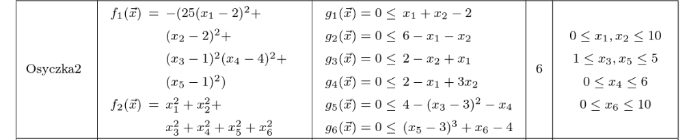
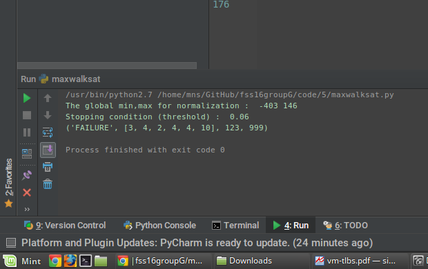

### MaxWalkSat

#### What is MaxWalkSat?
MaxWalkSat is a variant of WalkSat designed to solve the weighted satisfiability problem, in which each clause has associated with a weight, and the goal is to find an assignment—one which may or may not satisfy the entire formula—that maximizes the total weight of the clauses satisfied by that assignment.
Source : Wikipedia

#### Algorithm

```
FOR i = 1 to max-tries DO
  solution = random assignment
  FOR j =1 to max-changes DO
    IF  score(solution) > threshold
        THEN  RETURN solution
    FI
    c = random part of solution 
    IF    p < random()
    THEN  change a random setting in c
    ELSE  change setting in c that maximizes score(solution) 
    FI
RETURN failure, best solution found

```

#### Objective 
Minimize the osyczka2 model.


#### Output

`Format (w,x,y,z)`
* w - SUCCESS or FAILURE - Denotes if this run was able to converge to an acceptable solution
* x - The Solution list (x1,x2,..x6) in case of SUCCESS, or the last best solution in case of failure.
* y - The min value obtained during this run
* z - The number of tries before reaching a solution in case of SUCCESS and tries-1 in case of failure


------


------

A case of Failure for 1000 tries



