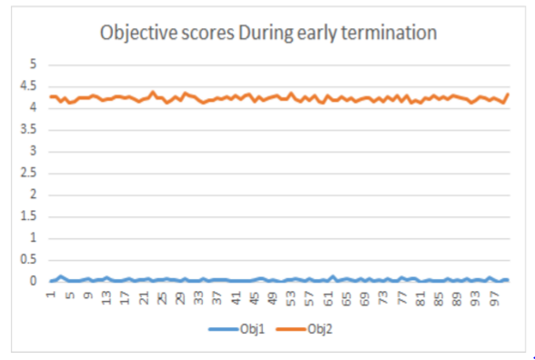
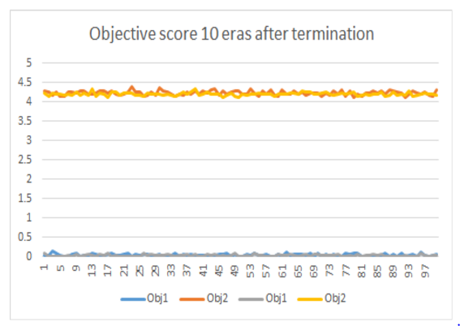

## Code7: early Termination

### Abstract
So far we have always allowed the optimizers to run for certain number of eras. But in many cases the solutions generated by these optimizers don't change 
after a certain number of eras. The optimizer can be early terminated when it reaches this stage and hence we can save a lot of computing power.

Also Every model produces different objectives and decisions Each model, when run with different optimizers. To identify the best optimizer, 
for which the model is being reduced or expanded to the target minimum or maximum, can be found by comparing the results of all the possible combinations.
This coding project works with the DTLZ7 model, on which Simulated Annealing, Max Walk Sat and Differential Evolution are performed. 
These results are compared based on the type comparators to provide a ranked output of the optimizers for this particular model.

### Introduction
In this study we try to find out which out of Differential Evolution , Simulated Annealing 
and MaxWalkSat is best to optimize DTLZ7 with 2 objectives and 10 decisions. To study these optimizers we use Type 1 , Type 2 and Type 3 comparison operators . 
To optimize a multiple objective model. different optimizers can be used . These optimizers may or may not find the best 
candidate solution . When we are using stochastic search to optimize a problem , we need some kind of statistical machinery to figure out whether or not the given optimizer is 
the best for the given problem being optimized. In this study our aim is to apply these comparison operators and find the best optimizer for a problem. These are the different 
comparison operators we use in this study.

### Models and Optimizers

**Simulated Annealing**

This optimizer avoids the settling of the model objective values at local minima by jumping to suboptimal points while the temperature
 is still low. The number of iterations is initially fixated and the temperature is set at zero and increased every iteration.
 An initial model object instance is created which is considered as the best candidate with best objectives. 
 For each iteration, the model is newly instantiated. The objectives of the generated candidate is compared with the best, 
 and if proven better, updates the best to hold the values of itself. A random value is generated and checked if it is greater 
 than the probability function, which determines if the candidate should remain where it is or take a risk of jumping to a worse solution. 
 The function takes the parameters of the old and new objective values of candidates and the temperature. The old value is copied to the 
 new value if the probability function returns true, or else, remains at the new candidate. This repeats for all iterations or until 
 it has lives remaining. The number of lives to be added or subtracted, and the candidate comparisons are performed by type 1 
 comparisons, which are described later in detail.

**Max Walk Sat**

Max Walk Sat is a non-parametric stochastic algorithm, which deals with analyzing the landscape of the data. 
Similar to Simulated Annealing, it prevents local minima by making jumps to random worse points. If the spread of the data is bumpy, 
this optimizer works most efficiently. It starts off by setting a maximum number of tries and changes, defining the number of iterations for 
which the optimizers runs (without early termination). Creation of object instance and shuffling it with the best instance to finally 
store the best energy seen so far occurs similar to SA. In addition to this, a probability is set and is checked if the generated random 
value is lesser. If so, the optimizer is still at it's early stages and can afford to jump to worse points to escape local minima. 
Thus, a decision is picked at random and changed. Else, the random decision is changed to obtain the best energy. The optimizer provides 
an output of the best combination of decisions and objectives.

**Differential Evolution**

This optimizer works in an intelligent manner by generating frontiers and ruling out bad decisions by binary or continuous domination 
mechanisms. It assumes that the final era or frontier is the best if it is dominated by at least one but worse of none of the previous values. 
It additionally takes an input of probability of crossover and extrapolate amount. The former decides the probability at which the other 
candidates should be extrapolated and the latter defines the ratio of extrapolation. Initially, a frontier of random candidates is generated 
and is further entered into the iteration of repeats, to keep randomly picking any other three candidates besides itself for mutation and 
extrapolation, if the generated random value is within the probability of crossover. This finally yields the final frontier, which comprises 
of the best candidates with least objectives, in the case of minimization problem.

**Scott-knott**

The Scott Knott [4] method makes use of a cluster analysis algorithm, where, starting from the whole group of observed mean effects, it divides, and keep dividing the sub-groups in such a way that the intersection of any two groups formed in that manner is empty [3]

**DTLZ7** 

DTLZ7 [1] is one of the models in the DTLZ class of models, which were designed to stress test optimizers. In this particular experiment I have used DTLZ7 with 10 decision variables and 2 objective functions. In later experiments, the DTLZ model as well as the number of variables and objective functions has been varied.


### Comparators
**Type1 Comparator**
Type 1 comparator is used to check if one solution in the population is better than another solution
The cumulative sum of each objective is used as the performance score.

**Type2 Comparator** [2]

Type2 operator is used to compare the solutions of two eras. A12 is used to calculate the difference between eras. This comparator is used to check if there is Small effect which can be used to early terminate an optimizer.
The A12 statistics measures the probability that running algorithm X yields higher values than running another algorithm Y.According to Vargha and Delaney, 
a small, medium, large difference between two populations is: 

* large if a12 is over 71%;
* medium if a12 is over 64%;
* small if a12 is 56%, or less.

Hence we consider a small effect so we set threshold to 0.56.

**Type3 Comparator**

For type3, we use effect size + hypothesis test (bootstrap) to judge no improvement in final era of multiple optimizers. 500 bootstraps was used with A12 and Scott-Knott. The stat.py contains rdivdemo 
method that tabulates the results in following manner showing median and inter-quartile range.

### Implementation
1. Code up Apply the above for DTLZ7 with 2 objectives 10 decisions.
2. Code up DE and MWS and SA and implement Type 1, Type 2 , Type 3 comparators
3. Find the final era computed by DE, MWS, SA (with early termination)
4. Compute the cdom loss numbers between era0 the final era
5. Pass the result to rdivdemo

### Results

**Comparison based on early Termination**

### Counts of Early termination
| Optimizer | Avg eras before termination |
|-----------|----------------------------------|
| MWS       | 7.1                              |
| SA        | 14.3                             |
| DE        | 17.1                             |

Inference:

From the table it is clear that, MWS converges to the solution quickly compared to DE and SA as it has a lot of early terminations
This is because MWS keeps making random jumps and the probability that it ends up at a better solution is higher. 
If the probability for local optimization is increased, then the number of early terminations for MWS increases.
This makes sense because in this scenario it will waste a lot of iterations to optimize locally.

Simulated annealing makes a lot of random jumps in the beginning and the probability of it making random jumps lessens as it cools down.
During the later stages of it life it spends more time optimizing locally. 

DE always maintains a frontier of best solutions. It randomly selects a member from the frontier
and extrapolates it and generates a new candidate. If the new candidate is better than the currently selected candidate, then it immediately replaces it immediately.
It provides better exploration but it the era0 is poor, then it takes a lot of time to converge as it mutates members of the frontier individually.


**Comparison based on CDOM loss**

```
rank ,         name ,    med   ,  iqr 
----------------------------------------------------
   1 ,           de ,    0   ,    1.17 (      -----   * |--            ), 0.18,  0.25,  0.98,  1.35,  1.98
   2 ,           sa ,    0   ,    1.55 (        --    * |  -----       ), 0.11,  0.17,  0.99,  1.94,  3.11
   2 ,          mws ,    1   ,    1.88 (          ---   |*    -------  ), 0.15,  0.73,  1.37,  2.54,  4.29
```


Inference:
DE has a better rank compared to SA and MWS. DE has a better performance and it has lesser IQR than the other 2 which means
that the solutions it produced were very consistent and didn't vary do much. This is because it maintains a very good set of solutions during
each iteration whereas both MWS and SA maintain only their best solution. So even through they terminate early the quality
of the solutions it generated over different baselines is not good. The result of Simulated Annealing is wider spread than the other two algorithms. 
This means that the optimizer is less consistent than the other two.


**Comparison of objective score before and after termination**

 

The above pictures shows the two objective scores before and after termination for DE.
This shows that the quality of the solution doesn't change too much after termination and hence the results of type 2 comparator is fair.


**Runtime implications of using Bootstrap:**
It took nearly 7.13 seconds to complete with bootstrapping methods on and 5.92 seconds when turned off.
But we need to try it for huge populations and more number of objectives to see if there is considerable difference or not.


### Threats to Validity
1. The early termination results are valid only for the case when the optimizers use the 
initial parameters we set. So there may be cases when DE terminates faster than MWS and SA.

2. Here we used only 5 lives to prevent an optimizer from early terminating with non optimal solutions.
This has to be more to be more sure that even when an optimizer early terminates, we get a nearly optimal solution

3. Early termination doesn't mean that an optimizer is always faster.

4. The results obtained are for minimal number of candidates and 
iterations in order to analyze the differences in performance metrics. These may vary and show more convergence if performed for prolonged iterations of larger populations. It is possible that the ranking 
of the optimizers shifts due to extended operations.

5. The optimizers are run on a specific model only, DTLZ7. 
This model has objectives which differ from those of other objectives. The performances of the optimizers cannot be concluded as best, better and worse based on these results alone. They may perform differently on 
other models, based on the objectives and decisions encountered.

6. These results have been obtained by running the
 optimizers on the model for 20 iterations each. This can
  be extended to include more number of iterations to get more accurate and precise results. Additionally, the population size can be increased to have a larger spread of candidates.


### Future Work

Based on the threats of validity and shortcomings of this project, this analysis can be extended to include more precise opertions and results in the future. Some of them are listed below.

1. These results have been obtained by running the optimizers on the model for 20 iterations each. This can be extended to include more number of iterations to get more accurate and precise results.
 Additionally, the population size can be increased to have a larger spread of candidates.

2. To greatly understand the performance of each optimizer on the model, future work can be done on improving the type 1,2 and 3 comparisons. 

3. This experiment can be extended for multiple model different number of decisions and objectives. This can help us gain a better understanding of which optimizer performs the best generally.

4. We can also extend this comparative study to other algorithms which we studied in class.

### References
* [1] [http://e-collection.library.ethz.ch/eserv/eth:24696/eth-24696-01.pdf](http://e-collection.library.ethz.ch/eserv/eth:24696/eth-24696-01.pdf)
* [2] [https://github.com/txt/ase16/blob/master/src/stats.py](https://github.com/txt/ase16/blob/master/src/stats.py)
* [3] [https://github.com/txt/ase16/blob/master/doc/perform.md](https://github.com/txt/ase16/blob/master/doc/perform.md) 
* [4] [https://rdrr.io/cran/ScottKnott/man/ScottKnott-package.html](https://rdrr.io/cran/ScottKnott/man/ScottKnott-package.html)