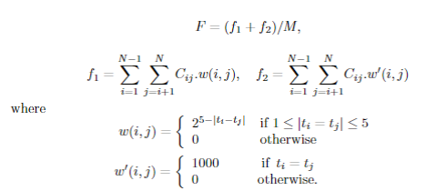

# ASE Fun project

#Time table Scheduling 

### Why?
There are certain class of problems called NP Hard and one of the ways of solving these problems
is through randomization and by the use of meta heuristics which is what 
We've been learning throughout the semester in **`CSC591 ASE`**

### Problem Statement
>Time table scheduling problem is a multi constrained , NP Hard , combinatorial 
optimization problem. One of the derivative of this problem is Examination
time tabling problem which takes in a list of courses offered by a university and schedules
the list of students enrolled in these courses and schedules the exams in
such a way that there are no overlaps for a student and the exams
are scheduled as far as possible within a specified window of dates.

### Description
* Decisions : 
    * A set of time slots (contiguous) T
    * A set of courses C
    * A set of Students S
    * A set of student enrollments E (Ideally a pair of Student Number and Course ID)

* Objectives :
    
    * The objective of the problem is to minimize the proximity cost.
    
    According to [this](#4) paper there are two sources of cost namely **"Soft constraints"** and **"Hard constraints"**
    
    In simple terms soft constraint occurs when a student has two exams in adjacent slots and hard
    constraints occur when the student has two exams in the same slot.
    
    This the proximity cost is the sum of these costs divided by the number of students
    
    

### What algorithms can we use to model this problem?

During the course we have come across a variety of meta heuristic algorithms like Simulated Annealing, 
Genetic algorithm , Particle Swarm optimization and so on.  Just for fun read about  **Ant colony Optimization** and try 
to model this problem with ACO

* #### Simulated Annealing :

* #### Genetic Algorithm :

* #### PSO :

* #### ACO :

### Papers on using evolutionary algorithms for Time table Scheduling

* J. M. Thompson and K. A. Dowsland,A Robust Simulated Annealing Based Examination Timetabling System, Computers and Operations Researchs25(7/8) (1998), 637-648. 
* M. W. Carter,A survey of practical applications of Examination Timetabling Algorithms, Operation Research34(2) (1986), 193-202. 
* A. Colorni, M. Dorigo and V. Maniezzo,Genetic Algorithms: A New Approach to the Timetabling Problem, The practic and theory of automated timetabling, Lecture Notes in Computer Science, eds. E. Burke and P. Ross. Springer1153(1996), 235-239. 
* M. W. Carter, G. Laporte and S. Y. Lee,Examination Timetabling: Algorithmic Strategies and Applications, Journal of the Operational Research Society47(1996), 373-383.

