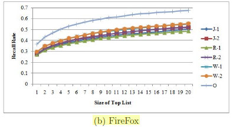

# Paper Title:
*A Discriminative Model Approach for Accurate Duplicate Bug Report Retrieval* 
(ICSE '10 Proceedings of the 32nd ACM/IEEE International Conference on Software Engineering - Volume 1)

# Keywords:
* **ii1. Tokenization**: Tokenization is the process of parsing a character stream into a sequence of word tokens by splitting the stream by the de-limiters. Tokenization is one of the important pre processing tasks in Information retrieval process.

* **ii2. Support Vector Machine (SVM)**: It is an approach to build-ing a discriminative model or classifier based on a set of labeled vectors. Given a set of vectors, some belonging to a positive class and others belonging to a negative class, SVM tries to build a hyperplane that separates vectors belonging to the positive class from those of the negative class with the largest margin.

* **ii3. Recall rate**: Recall rate is defined as the ratio of number of duplicate reports whose masters are successfully detected to the total number of duplicate reports for testing the retrieval process. In other words it gives the percentage of duplicates whose masters are successfully retreived in the list.

* **ii4. Feature Engineering** - Feature engineering is a process of using domain knowledge of the data to create, extract features that makes machine learning algorithm work.

# Notes:
* **iii1. Motivational Statements:**
Among several automated detection approaches, text-based information retrieval (IR) approaches have been shown to outperform others in term of both accuracy and time efficiency. However, those IR-based approaches do not detect well the duplicate reports on the same technical issues written in different descriptive terms.

* **iii2. Data:**
Data (bug reports) have been taken from three popular open source projects - Eclipse (IDE), Firefox (Web browser) and OpenOffice (Office Suite). These sources were chosen because they were large software projects with big bug repositories and they were all written in different languages so that a generalised result can be found.

  | Dataset | Time Frame | Training Reports (Duplicate/All) | sting Reports(Duplicate/All)| 
  ----------|------------|----------------------------------|-----------------------------|
  |OpenOffice |Jan/02/2008–Dec/30/2008|100/3160|529/9572 |
  |Firefox|Apr/04/2002–Jul/07/2007|100/962|3207/46359 |
  |Eclipse |Jan/02/2008–Dec/30/2008|100/4265|1913/40387 |

* **iii3. Related Work:**
Similar work has been seen in paper such as - *L. Hiew. Assisted detection of duplicate bug reports.Master’s thesis, University of British Columbia, 2006.* and *A. T. Nguyen, T. T. Nguyen, J. Al-Kofahi, H. V. Nguyen, and T. N. Nguyen. A Topic-based Approach for Narrowing the Search Space of Buggy Files from a Bug Report. In ASE’11, pp. 263-272. IEEE CS, 2011.*

* **iii4. Baseline results:** The following figure shows the results of this discriminative model based approach on the three datasets over seven runs compared to earlier methods.

  |

# Improvements:
* **iv1.** DBTM is shown to perform well with bug reports have reasonably large number of topics `(k > 60)`. Those type of bug reports are obviously more complex and hence the chances of it being detected by developers and testers is less. On the other hand, more bug reports would be submitted for the bug that is more common and less complex and hence will have lesser number of topics. The paper has not given equal importance to reports with reasonably lesser number of features (20-40).

* **iv2.**  Experiments were run on open source projects like `OpenOffice, Eclipse and Mozilla`. These projects are well maintained and used by power users and developers which might not always be the case with other software which are meant for the masses (especially those that have public beta testing programs that allow common users to send bug reposts)

* **iv3.** Many open source projects are contributed by people all around the world who might use different languages. The `effect of NLP and translation` before applying the algorithms could have been discussed a bit more. 

* **iv4.** The author could have added a section of future work so that further work based on their work could be figured out.
